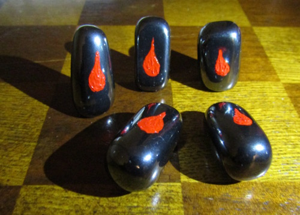
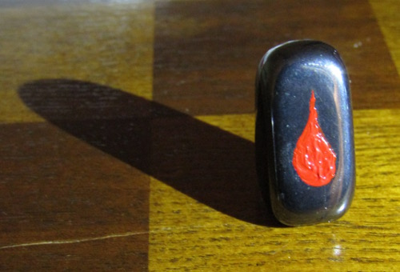

# BLOODSTONES

Bloodstones are a universal, open source board game mod. They can augment virtually any board game.

A set of "classic" Bloodstones is comprised of 5 similar pieces of [hematite](https://en.wikipedia.org/wiki/Hematite), each marked with the symbol of a blood droplet. Game augmentations are called "Transfusions", and owners of Bloodstones are allowed to call themselves "Bloodkeepers".

## RULES

The rules of Bloodstones are flexible and can be determined by players. However, one mechanic must be present:

**The sacrifice of a single drop of blood.**

A player, for example, might have to sacrifice if:

 - they lose a Bloodstone they started with,

 - they end the game with a Bloodstone they did not originally have,

 - they lose a wager of Bloodstones

These general rule templates can be specialized for individual games as desired.

## POSSIBLE TRANSFUSIONS

 - **Chess:** A Bloodstone is placed in each Rook's castle-top basket. If one of your Rooks is captured, you must take its Bloodstone.

 - **Settlers of Catan:** If a player rolls a 7 with more than the allowable limit of cards in their hand, they receive a Bloodstone along with the usual penalties.

 - **Ticket To Ride:** At setup, Bloodstones are placed on chosen 6x-length routes. In order to complete one of those routes, the player must pay the price in blood as well as trains.

To contribute a Transfusion, or to submit a picture of your own set of homemade Bloodstones, please create a Pull Request.

## THE SOCIAL ANGLE

Bloodstones are to remind you of those living with [Diabetes](https://en.wikipedia.org/wiki/Diabetes_mellitus), who must sacrifice drops of their blood daily in order to measure blood sugar levels. **Please donate to a reputable charitable organization in your area each time you run a Bloodstones Transfusion.**

## DISCLAIMER

Do not play with Bloodstones without first seeking the advice of a medical professional. Always use sterile instruments and great care when sacrificing your blood. Never share instruments between players. Never let someone else sacrifice your blood for you. Never force or coerce anyone else to play with Bloodstones. Do not use Bloodstones to augment a game if it violates the license of that game. Keep blood away from other players and the game itself. Do not play with Bloodstones if you are unwilling to take full responsibility for any consequences.

## LICENSE

Bloodstones is licensed under the [MIT License](./LICENSE).
